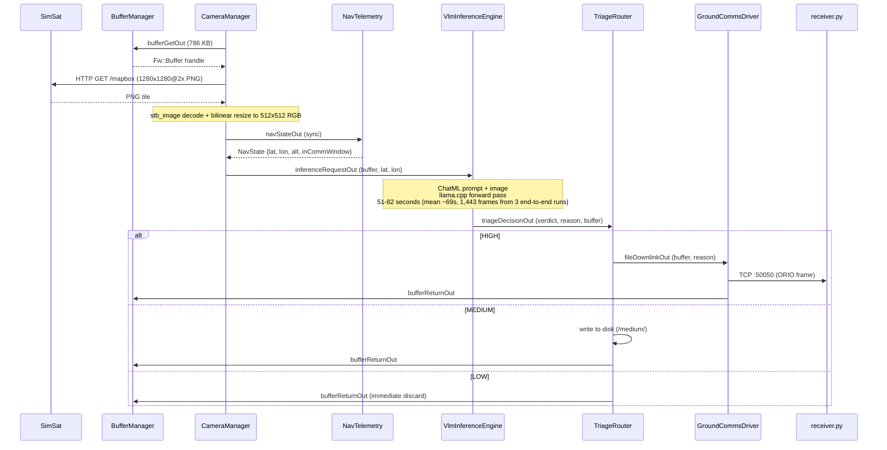
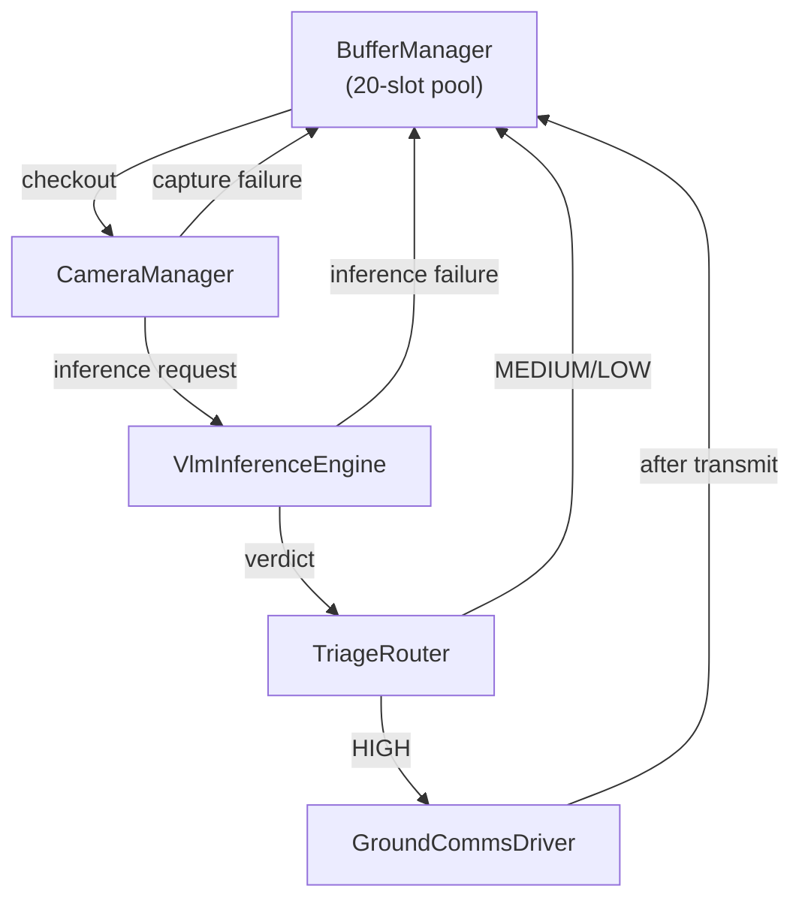
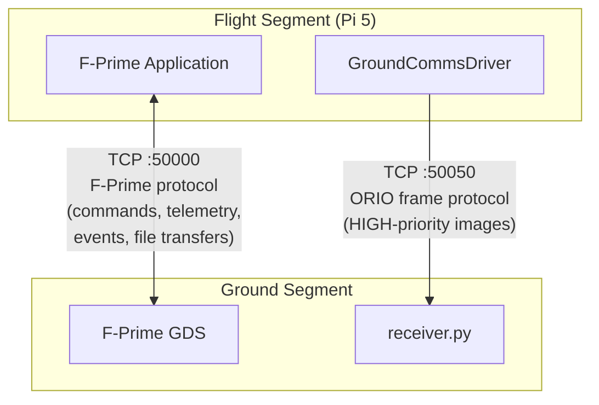

# Data Flow

This page describes the end-to-end pipeline from image capture through VLM inference and triage to ground station receipt.

## Pipeline Overview



## Stage 1: Image Capture

**Component:** CameraManager

1. `CameraManager` checks out a 786,432-byte buffer (512x512x3 RGB) from the `BufferManager` pool.
2. It issues an HTTP GET to SimSat's Mapbox API endpoint, which returns a 1280x1280@2x PNG satellite tile for the current ground track position. The PNG is decoded via `stb_image` and bilinear-resized to 512x512 via `stb_image_resize2` into the pre-allocated buffer. The 512x512 resolution matches what a typical smallsat camera payload would produce and keeps memory usage bounded on the Pi 5; in a real mission, the camera sensor would output frames at its native resolution directly into the buffer with no resize.
3. If SimSat is unreachable or the position is over open ocean with no tile available, the buffer is returned to the pool and a `SimSatImageUnavailable` event is emitted.
4. On success, `CameraManager` makes a synchronous call to `NavTelemetry` via the `NavStatePort` to obtain the GPS coordinates (lat, lon) at the exact moment of capture.
5. The buffer and coordinates are dispatched asynchronously to `VlmInferenceEngine` via the `InferenceRequestPort`. CameraManager then returns to sleep: it does not wait for inference to complete.

**Auto-capture timing:** In MEASURE mode, auto-capture fires every 85 seconds (configurable, minimum 85s). This interval must exceed the worst-case inference time (~82s measured) to avoid saturating the 5-entry VLM queue.

## Stage 2: VLM Inference

**Component:** VlmInferenceEngine

### Prompt Construction

The engine builds a ChatML-formatted prompt that includes the model's image marker token and the captured GPS coordinates:

```
<|im_start|>user
<image_marker>
You are an autonomous orbital triage assistant. Analyze this
high-resolution RGB satellite image captured at Longitude: {lon},
Latitude: {lat}.
Strictly use one of these categories based on visual morphology:
- HIGH: Extreme-scale strategic anomalies, dense geometric cargo/vessel
  infrastructure, massive cooling towers, sprawling runways, or distinct
  geological/artificial chokepoints.
- MEDIUM: Standard human civilization. Ordinary urban grids, low-density
  suburban sprawl, regular checkerboard agriculture, or localized
  infrastructure.
- LOW: Complete absence of human infrastructure. Featureless deep oceans,
  unbroken canopy, barren deserts, or purely natural geological formations.
You MUST output your response as a valid JSON object. To ensure accurate
visual reasoning, you must output the "reason" key FIRST, followed by
the "category" key.<|im_end|>
<|im_start|>assistant
```

### Inference Pipeline

1. **Tokenize**: `mtmd_tokenize()` replaces the image marker in the text prompt with vision encoder output tokens. The raw 512x512 RGB buffer is wrapped as an `mtmd_bitmap` and passed through the multimodal projection layer (mmproj-f16.gguf). Image tokens are capped at 1024 to conserve KV cache space.

2. **Evaluate**: `mtmd_helper_eval_chunks()` processes all chunks (text + vision tokens) into the KV cache with a batch size of 512.

3. **Generate**: Tokens are sampled greedily one at a time (up to 200 response tokens). Each token is checked against the 120-second inference timeout.

4. **Parse**: The raw text output is parsed for a JSON object containing `"reason"` and `"category"` keys. The category is matched against `"HIGH"`, `"MEDIUM"`, or `"LOW"` (case-sensitive with fallback). If no category is found, the verdict defaults to LOW.

5. **Cleanup**: The KV cache is cleared and the sampler is reset after every frame, so each inference starts from a clean state.

### Expected Output Format

```json
{
  "reason": "Dense port infrastructure with geometric cargo vessels and large crane structures visible",
  "category": "HIGH"
}
```

### Failure Handling

- If the model is not loaded, the frame is dropped and `FrameDroppedModelNotLoaded` is emitted.
- If tokenization, evaluation, or sampling fails, `InferenceFailed` is emitted and the buffer is returned to the pool directly (bypasses TriageRouter).
- If inference exceeds 120 seconds, `InferenceTimeout` is emitted, the KV cache is forcibly cleared, and the frame is dropped.

## Stage 3: Triage Routing

**Component:** TriageRouter

The `TriageDecisionPort` carries the verdict (`TriagePriority` enum), reasoning string, and the original buffer handle. TriageRouter applies the triage doctrine:

### HIGH: Immediate Downlink

The buffer and reason string are forwarded to `GroundCommsDriver` via the `FileDownlinkPort`. Buffer ownership transfers to the driver. A `HighTargetDetected` event is emitted with the VLM's reasoning.

### MEDIUM: Disk Storage

The raw image data is written to the medium storage directory (`ORION_MEDIUM_STORAGE_DIR`, default `./media/sd/medium/`) as `orion_medium_XXXXX.raw`. The buffer is returned to the pool after the write completes. A `MediumTargetStored` event is emitted.

MEDIUM files are downloaded to the ground later via the `FLUSH_MEDIUM_STORAGE` command, which uses the standard F-Prime `FileDownlink` service. EventAction paces this at one file per tick (1 Hz) to avoid overwhelming FileDownlink's 10-entry queue.

### LOW: Discard

The buffer is returned to the pool immediately. No data is saved. A `LowTargetDiscarded` event is emitted.

## Stage 4: Downlink

**Component:** GroundCommsDriver

### ORIO Frame Protocol

> Full field-level specification: [Ground Receiver - ORIO Frame Protocol](../ground-segment/receiver.md#orio-frame-protocol)

Every image transmitted over the custom TCP link uses a simple framing protocol:

```
+--------+--------+---------------------------+
| Offset | Size   | Field                     |
+--------+--------+---------------------------+
| 0      | 4 bytes| Magic: "ORIO" (0x4F52494F)|
| 4      | 4 bytes| Payload length (uint32 BE)|
| 8      | N bytes| Raw image payload          |
+--------+--------+---------------------------+
```

- All multi-byte integers are in **network byte order** (big-endian).
- For a standard 512x512 RGB frame, the payload length is 786,432 bytes.
- Each frame is sent over a new TCP connection to the ground station receiver (`ORION_GDS_HOST`:`ORION_GDS_PORT`, default `127.0.0.1:50050`).

### Transmission Behavior

The driver's behavior depends on the current mission mode:

**In DOWNLINK mode (comm window open):**

1. On receiving a HIGH frame, first flush any previously queued frames from the disk queue.
2. Transmit the current frame over TCP.
3. Return the buffer to the pool.

**Outside DOWNLINK mode (comm window closed):**

1. Save the raw image data to the disk queue directory (`ORION_DOWNLINK_QUEUE_DIR`) as `orion_queued_XXXXX.raw`.
2. Return the buffer to the pool.
3. When DOWNLINK mode is entered (comm window opens), the `modeChangeIn` handler and the 1 Hz `schedIn` handler both trigger queue flush attempts.

### Queue Flush Logic

During a comm window, the driver reads queued `.raw` files from the disk queue directory, transmits each one using the ORIO frame protocol, and deletes the file after a successful transmit. If a transmit fails (receiver down), the flush stops immediately to avoid wasting time on a dead link. HIGH queue files are deleted immediately after transmit (the data is already in memory). MEDIUM files use a deferred cleanup: they are renamed to `.sent` when queued to FileDownlink (which reads asynchronously), then deleted when the next `FLUSH_MEDIUM_STORAGE` command is issued.

### Ground Station Receiver

`receiver.py` listens on TCP port 50050 and implements the receive side of the ORIO protocol:

1. Accept an incoming TCP connection.
2. Read the 8-byte header and validate the `ORIO` magic word.
3. Read the payload (length specified in the header).
4. Save the frame to `ground_segment/data/downlinked_XBand/orion_frame_XXXX.raw` and convert it to a viewable `.jpg`.

## MEDIUM Bulk Download

MEDIUM images are not transmitted over the custom TCP link. Instead, they use the standard F-Prime `FileDownlink` service over the F-Prime ground link (TCP port 50000).

The workflow:

1. During a comm window, the operator sends the `FLUSH_MEDIUM_STORAGE` command.
2. `EventAction` iterates over the medium storage directory, renaming each file to `.sent` and queuing it via `Svc.SendFileRequest` to the `FileHandling` subtopology's `FileDownlink` component.
3. Files are paced at one per tick (1 Hz) to stay within FileDownlink's 10-entry queue limit.
4. If the queue is full, the file is renamed back for retry on the next tick.
5. If the satellite exits DOWNLINK mode mid-flush, the flush is aborted and a `MediumStorageFlushed` event reports the count of files successfully queued.
6. On the GDS side, reassembled files arrive in the directory set via `--file-storage-directory` when launching GDS (usually `../../ground_segment/data/downlinked_UHF/`).
7. Convert the downloaded `.raw` files to viewable JPGs: `python ground_segment/raw_to_jpg.py ./data/downlinked_UHF/fprime-downlink`

**GDS status indicator flicker:** During a MEDIUM flush, FileDownlink sends 786 KB files every ~3 seconds through the same TCP :50000 link used for telemetry and events. The file data saturates the ComQueue, starving regular telemetry packets. The GDS interprets the gap in telemetry as a connection loss (red cross), then recovers when the next telemetry packet gets through (green light). This is cosmetic as no data is lost and all file transfers complete successfully.

## Buffer Lifecycle

Every buffer in the system follows a strict ownership chain. At any point, exactly one component owns each buffer:



No buffer is ever leaked. Every code path: success, failure, SAFE mode drop, timeout: ends with a `bufferReturnOut` call back to the `BufferManager`.

## Communication Paths

ORION uses two independent communication links:



| Link                      | Port  | Protocol              | Direction        | Purpose                                                             |
| ------------------------- | ----- | --------------------- | ---------------- | ------------------------------------------------------------------- |
| F-Prime ground link       | 50000 | F-Prime CCSDS framing | Bidirectional    | Commands, telemetry, events, MEDIUM file downloads via FileDownlink |
| Custom X-band (simulated) | 50050 | ORIO frame protocol   | Flight-to-ground | HIGH-priority image downlink in real time                           |

## Environment Variables

The variables that configure this data pipeline are documented in full (defaults, descriptions, and example workflow) in the [Flight Segment Environment Variables](../guides/environment-variables.md) guide. The table below shows where each variable is consumed in the pipeline.

| Variable                   | Default                            | Description                                          |
| -------------------------- | ---------------------------------- | ---------------------------------------------------- |
| `ORION_GGUF_PATH`          | `./orion-q4_k_m.gguf`              | Path to the Q4_K_M quantized text model              |
| `ORION_MMPROJ_PATH`        | `./orion-mmproj-f16.gguf`          | Path to the F16 multimodal projection model          |
| `ORION_MEDIUM_STORAGE_DIR` | `./media/sd/medium/`               | Directory for MEDIUM image bulk storage              |
| `ORION_DOWNLINK_QUEUE_DIR` | `./media/sd/downlink_XBand_queue/` | Directory for HIGH frames queued outside comm window |
| `ORION_GDS_HOST`           | `127.0.0.1`                        | Ground station receiver IP address                   |
| `ORION_GDS_PORT`           | `50050`                            | Ground station receiver TCP port                     |
| `ORION_SIMSAT_URL`         | `http://localhost:9005`            | SimSat base URL (e.g., `http://192.168.1.183:9005`)  |
