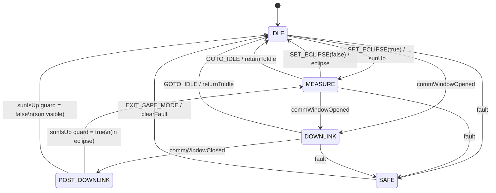

# Mission Mode State Machine

The ORION satellite operates under a four-state finite state machine (`MissionModeSm`) owned by the `EventAction` component. The FSM governs the entire pipeline: capture, inference, routing, and downlink are all gated by the current mission mode.

## States

| State        | Description                                                   | Pipeline Behavior                                                                                                                                         |
| ------------ | ------------------------------------------------------------- | --------------------------------------------------------------------------------------------------------------------------------------------------------- |
| **IDLE**     | Sunlit / charging phase. Batteries recharge via solar panels. | All pipeline operations idle. Model unloaded from RAM. No captures.                                                                                       |
| **MEASURE**  | Eclipse / imaging phase. Satellite is on battery power.       | Auto-capture enabled. Model loaded into RAM. VLM inference active. Triage routing active.                                                                 |
| **DOWNLINK** | Communication window. Ground station is in range.             | HIGH frames transmitted via TCP. Disk queue flushed. MEDIUM bulk download available via `FLUSH_MEDIUM_STORAGE`. Model stays loaded (reload is expensive). |
| **SAFE**     | Fault condition. All operations suspended.                    | All incoming frames dropped. Model unloaded. No captures, no downlink.                                                                                    |

## Power Doctrine

ORION's power doctrine is counterintuitive by design:

- **MEASURE during eclipse**: The satellite cannot charge its batteries anyway (no solar power), so it spends battery energy on imaging and inference.
- **IDLE during sunlit**: Solar panels are active, so the satellite charges its batteries and conserves power for the next eclipse pass.

This mapping is reflected in the state machine signals: the `sunUp` signal transitions to MEASURE (eclipse started, activate imaging), and the `eclipse` signal transitions to IDLE (sun visible, charge batteries). The signal names are abstract identifiers in the FPP state machine definition; the `SET_ECLIPSE` command handler inverts them to match the power doctrine.

## State Diagram

### POST_DOWNLINK Choice

When a comm window closes, the state machine enters the `POST_DOWNLINK` choice pseudostate. The `sunIsUp` guard determines the next state:

- If the satellite is in eclipse (`m_inEclipse == true`), the guard returns `true` and the FSM transitions to MEASURE to resume imaging.
- If the sun is visible (`m_inEclipse == false`), the guard returns `false` and the FSM transitions to IDLE to charge batteries.

## Commands

| Command                | Opcode | Description                                                                                                                                   | Allowed From            |
| ---------------------- | ------ | --------------------------------------------------------------------------------------------------------------------------------------------- | ----------------------- |
| `SET_ECLIPSE`          | 0x00   | Sets the eclipse flag. `true` (eclipse) triggers transition to MEASURE; `false` (sun visible) triggers return to IDLE.                        | Any (signal-based)      |
| `ENTER_SAFE_MODE`      | 0x01   | Forces immediate transition to SAFE from any operational state.                                                                               | IDLE, MEASURE, DOWNLINK |
| `EXIT_SAFE_MODE`       | 0x02   | Returns from SAFE to IDLE. Re-syncs with current comm window and eclipse state.                                                               | SAFE                    |
| `GOTO_IDLE`            | 0x10   | Manual transition to IDLE.                                                                                                                    | MEASURE, DOWNLINK       |
| `GOTO_MEASURE`         | 0x11   | Manual transition to MEASURE.                                                                                                                 | IDLE                    |
| `GOTO_DOWNLINK`        | 0x12   | Manual transition to DOWNLINK.                                                                                                                | IDLE                    |
| `FLUSH_MEDIUM_STORAGE` | 0x03   | Queues all MEDIUM images for bulk download via F-Prime FileDownlink. Paced at one file per tick to avoid overwhelming the FileDownlink queue. | DOWNLINK                |

The `GOTO_*` commands are ground operator overrides for forcing a mode entry that the autonomous logic would not trigger on its own (e.g. entering DOWNLINK outside a comm window, or MEASURE without an eclipse signal). Once in the target state, autonomous transitions still apply normally; for instance, `GOTO_IDLE` during a comm window will be followed by an automatic transition to DOWNLINK on the next `commWindowOpened` edge.

## Comm Window Detection

The comm window is determined by `NavTelemetry` using the Haversine formula to compute great-circle distance between the satellite and the ground station.

**Ground station coordinates (default):** EPFL, Ecublens, Switzerland: 46.5191N, 6.5668E

**Range:** 2000 km (configurable via `ORION_GS_RANGE_KM` environment variable)

**Hysteresis (10%):**

- Comm window **opens** when distance < 2000 km
- Comm window **closes** when distance > 2200 km (2000 km x 1.1)

This 10% hysteresis band prevents rapid oscillation when the satellite ground track passes near the range boundary. `NavTelemetry` polls SimSat every 5 seconds and updates the `inCommWindow` flag. `EventAction` detects edges (open/close) at 1 Hz and sends the corresponding `commWindowOpened` / `commWindowClosed` signals to the state machine.

## Mode Broadcast

On every state transition, `EventAction` broadcasts the new `MissionMode` to all four pipeline components via the `ModeChangePort` array:

| Port Index | Target Component   | Behavior on Mode Change                                                                                        |
| ---------- | ------------------ | -------------------------------------------------------------------------------------------------------------- |
| 0          | CameraManager      | Auto-enables capture on MEASURE entry; disables on all other modes.                                            |
| 1          | GroundCommsDriver  | Transmits frames in DOWNLINK; queues to disk otherwise. Flushes disk queue on DOWNLINK entry.                  |
| 2          | VlmInferenceEngine | Auto-loads model on MEASURE entry; unloads on IDLE/SAFE. Drops frames in SAFE. Keeps model loaded in DOWNLINK. |
| 3          | TriageRouter       | Drops all frames in SAFE mode. Routes normally otherwise.                                                      |

## Environment Variables

| Variable            | Default | Description                        |
| ------------------- | ------- | ---------------------------------- |
| `ORION_GS_LAT`      | 46.5191 | Ground station latitude (degrees)  |
| `ORION_GS_LON`      | 6.5668  | Ground station longitude (degrees) |
| `ORION_GS_RANGE_KM` | 2000.0  | Comm window range threshold (km)   |
