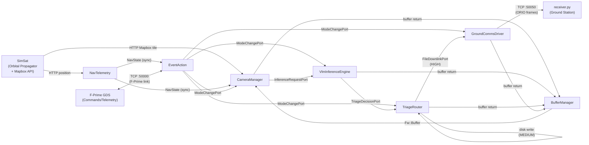

# System Architecture

ORION is a two-segment system: a **flight segment** running on a Raspberry Pi 5 in orbit, and a **ground segment** at the EPFL Ecublens ground station in Switzerland.

## Flight Segment

The flight segment is an F-Prime deployment (`Orion`) composed of six custom active/passive components plus the standard F-Prime infrastructure (CdhCore, ComCcsds, FileHandling, DataProducts subtopologies).

### Component Inventory

| Component               | Real Satellite Equivalent            | Type    | Priority | Role                                                                                                                                           |
| ----------------------- | ------------------------------------ | ------- | -------- | ---------------------------------------------------------------------------------------------------------------------------------------------- |
| **EventAction**         | On-Board Computer (OBC) mode manager | Active  | 38       | Mission mode state machine owner. Evaluates mode transitions at 1 Hz, broadcasts mode changes to all pipeline components.                      |
| **NavTelemetry**        | GNSS receiver payload                | Active  | 35       | Polls SimSat for orbital position every 5 seconds. Computes Haversine distance to ground station and determines comm window state.             |
| **CameraManager**       | Earth observation camera payload     | Active  | 30       | Acquires imagery from SimSat's Mapbox API. Fuses GPS telemetry and dispatches to the VLM queue. Auto-capture at 65s intervals in MEASURE mode. |
| **VlmInferenceEngine**  | On-board AI co-processor             | Active  | 10       | Runs the LFM2.5-VL-1.6B model via llama.cpp. 120-second per-frame timeout with KV cache reset on abort.                                        |
| **TriageRouter**        | On-board data handling unit          | Active  | 25       | Executes triage doctrine: HIGH to downlink, MEDIUM to storage, LOW discarded. Drops all frames in SAFE mode.                                   |
| **GroundCommsDriver**   | X-band radio transmitter             | Active  | 20       | Manages the simulated X-band link. Transmits HIGH frames over TCP. Queues to disk outside comm window.                                         |
| **BufferManager**       | On-board mass memory                 | Passive | :        | Static pool of 20 x 786,432-byte (512x512 RGB) image buffers.                                                                                  |
| **comDriver** (F-Prime) | UHF radio transceiver                | Passive | :        | F-Prime TcpClient on port 50000. Always-on command/telemetry link to GDS.                                                                      |

### Rate Groups

All ORION components are driven by a 1 Hz Linux timer through three rate groups:

| Rate Group | Frequency | Members                                                                                                                       |
| ---------- | --------- | ----------------------------------------------------------------------------------------------------------------------------- |
| RG1        | 1 Hz      | Telemetry send, FileDownlink, SystemResources, ComQueue, CmdDisp, NavTelemetry, CameraManager, GroundCommsDriver, EventAction |
| RG2        | 0.5 Hz    | CmdSequencer                                                                                                                  |
| RG3        | 0.25 Hz   | Health watchdog, BufferManagers (Comms, DataProducts, ORION), DataProducts writer/manager                                     |

### Shared Utilities (`Orion/Utils/`)

The `Utils/` directory contains plain C++ helpers that are not F-Prime components. They are linked into the flight binary and called directly by components:

| Utility        | Consumers                   | Description                                                                                                                                                                                                                                                                   |
| -------------- | --------------------------- | ----------------------------------------------------------------------------------------------------------------------------------------------------------------------------------------------------------------------------------------------------------------------------- |
| `SimSatClient` | NavTelemetry, CameraManager | Stateless libcurl wrapper for the SimSat REST API. `fetchPosition()` returns lat/lon/alt; `fetchMapboxImage()` fetches a Mapbox tile, decodes the PNG via vendored `stb_image`, resizes to 512x512 via `stb_image_resize2`, and writes raw RGB into a caller-provided buffer. |

Vendored single-file libraries in `Orion/Vendor/`:

| Header                | Version                                | Purpose                                                  |
| --------------------- | -------------------------------------- | -------------------------------------------------------- |
| `stb_image.h`         | [stb](https://github.com/nothings/stb) | PNG decoding of SimSat Mapbox responses                  |
| `stb_image_resize2.h` | [stb](https://github.com/nothings/stb) | Resizing to 512x512 when the tile dimensions don't match |

## Ground Segment

The ground segment consists of three software elements:

### receiver.py: Image Downlink Receiver

A standalone Python TCP server listening on port **50050**. Accepts incoming ORIO-framed image data from `GroundCommsDriver`, validates the 8-byte header (magic `ORIO` + payload length), and writes each 512x512 RGB frame to disk as both a `.raw` file and a viewable `.jpg`.

### F-Prime GDS: Command and Telemetry

The standard F-Prime Ground Data System connects to the flight segment over TCP port **50000** via `Drv.TcpClient`. Provides:

- **Uplink**: Command dispatch (SET_ECLIPSE, ENTER_SAFE_MODE, LOAD_MODEL, TRIGGER_CAPTURE, etc.)
- **Downlink**: Telemetry channels (position, mode, inference time, triage counts), event logs, and file transfers

### SimSat: Orbital Simulator (External)

An external service (default port 9005) that provides:

- **Orbital propagator**: Returns current latitude, longitude, and altitude via HTTP
- **Mapbox satellite tiles**: Returns 512x512 RGB imagery for the satellite's current ground track position
