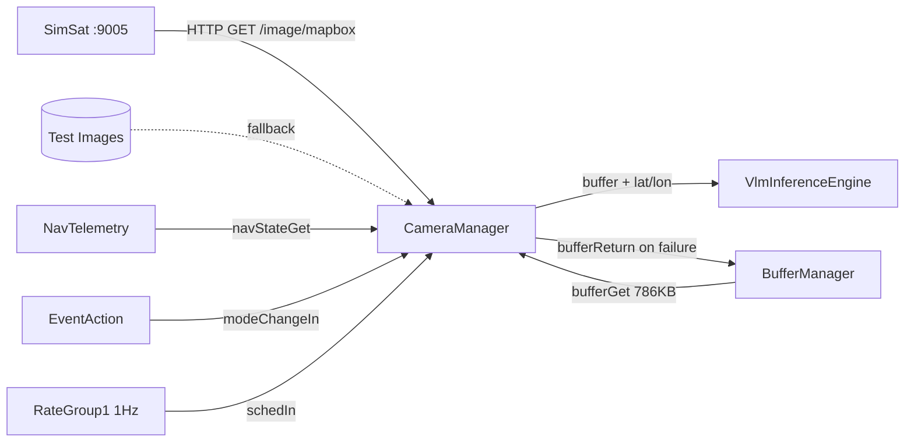

# Orion::CameraManager Component

## 1. Introduction

The `Orion::CameraManager` component acquires Earth observation imagery for the ORION satellite. In autonomous mode, it periodically fetches Mapbox satellite images from [SimSat](../../../Utils/SimSatClient.hpp) via HTTP, fuses GPS coordinates from [NavTelemetry](../../NavTelemetry/docs/sdd.md), and dispatches the raw image buffer to [VlmInferenceEngine](../../VlmInferenceEngine/docs/sdd.md) for triage classification.

CameraManager also supports manual ground-commanded captures via `TRIGGER_CAPTURE` and falls back to pre-loaded test images from disk when SimSat is unreachable.

In a real mission, the SimSat/Mapbox image fetch would be replaced by a hardware camera driver (e.g., a CSI sensor via V4L2).

## 2. Requirements

| Requirement  | Description                                                                       | Verification Method |
| ------------ | --------------------------------------------------------------------------------- | ------------------- |
| ORION-CM-001 | CameraManager shall fetch satellite imagery from SimSat's Mapbox API              | System test         |
| ORION-CM-002 | CameraManager shall fall back to test images from disk when SimSat is unreachable | System test         |
| ORION-CM-003 | CameraManager shall fuse GPS coordinates from NavTelemetry at capture time        | Inspection          |
| ORION-CM-004 | CameraManager shall dispatch image + GPS to VlmInferenceEngine asynchronously     | Inspection          |
| ORION-CM-005 | CameraManager shall auto-enable captures on MEASURE entry and disable on exit     | System test         |
| ORION-CM-006 | CameraManager shall return buffers to the pool on capture failure                 | Inspection          |
| ORION-CM-007 | CameraManager shall emit a warning on buffer pool exhaustion                      | System test         |

## 3. Design

### 3.1 Data Flow

### 3.2 Capture Pipeline (`doCapture`)

Each capture executes the following steps:

1. **Buffer checkout** — requests a 786,432-byte (512x512x3 RGB) buffer from BufferManager. If the pool is exhausted, logs `BufferPoolExhausted` and aborts.
2. **Image acquisition** — tries SimSat Mapbox API first (`SimSatClient::fetchMapboxImage`). On failure, falls back to sequential test images from `ORION_TEST_IMAGE_DIR`. If both fail, logs `CameraHardwareError` and returns the buffer.
3. **GPS fusion** — synchronously queries NavTelemetry via `navStateOut` for the current lat/lon at the exact moment of capture.
4. **Dispatch** — fires `inferenceRequestOut` asynchronously to VlmInferenceEngine. Buffer ownership transfers.
5. **Telemetry** — increments `ImagesCaptured` and logs `ImageDispatched` with coordinates.

### 3.3 Image Acquisition

**SimSat path:** `SimSatClient::fetchMapboxImage()` performs:

- HTTP GET to `ORION_SIMSAT_URL/data/current/image/mapbox` (30s timeout)
- Checks `mapbox_metadata` header for `image_available` and `target_visible`
- Decodes the PNG response via `stb_image`
- Resizes to 512x512 via `stb_image_resize2` if dimensions don't match
- Writes raw RGB bytes directly into the F-Prime buffer

**Test image fallback:** If SimSat is unreachable or reports no image available:

- Logs `SimSatImageUnavailable`
- Reads the next `image_XXXX.raw` from `ORION_TEST_IMAGE_DIR` (cycles through `NUM_TEST_IMAGES` = 300)
- If the test image file doesn't exist or read fails, `captureIntoBuffer` returns false and `CameraHardwareError` is logged

### 3.4 Auto-Capture Timing

Auto-capture is driven by the 1 Hz `schedIn` tick with an internal counter:

- **Interval:** configurable via `ENABLE_AUTO_CAPTURE` command (default 45 seconds)
- **Enable:** automatically on MEASURE entry, or manually via command
- **Disable:** automatically on any mode exit from MEASURE, or manually via command
- **Guard:** `schedIn_handler` checks both `m_autoCaptureEnabled` AND `m_currentMode == MEASURE`

The 45-second default matches the VLM's inference throughput on the Pi 5 (10-45s per frame), preventing queue buildup.

### 3.5 Port Diagram

| Port                  | Direction     | Type                   | Description                                  |
| --------------------- | ------------- | ---------------------- | -------------------------------------------- |
| `schedIn`             | async input   | `Svc.Sched`            | 1 Hz rate group tick for auto-capture timing |
| `modeChangeIn`        | async input   | `ModeChangePort`       | Receives mode broadcasts from EventAction    |
| `bufferGetOut`        | output (sync) | `Fw.BufferGet`         | Checks out a 786KB buffer from BufferManager |
| `navStateOut`         | output (sync) | `NavStatePort`         | Queries NavTelemetry for GPS at capture time |
| `inferenceRequestOut` | output        | `InferenceRequestPort` | Dispatches image + GPS to VlmInferenceEngine |
| `bufferReturnOut`     | output        | `Fw.BufferSend`        | Returns buffer on capture failure            |

### 3.6 Commands

| Command                | Opcode | Arguments       | Behavior                                                                                    |
| ---------------------- | ------ | --------------- | ------------------------------------------------------------------------------------------- |
| `TRIGGER_CAPTURE`      | 0x00   | none            | Manual single-shot capture. Works in any mode (buffer returned by VLM if model not loaded). |
| `ENABLE_AUTO_CAPTURE`  | 0x01   | `interval: U32` | Sets capture interval in seconds and enables auto-capture                                   |
| `DISABLE_AUTO_CAPTURE` | 0x02   | none            | Stops auto-capture                                                                          |

### 3.7 Events

| Event                    | Severity    | Description                                                               |
| ------------------------ | ----------- | ------------------------------------------------------------------------- |
| `ImageDispatched`        | ACTIVITY_HI | Logged per successful capture with lat/lon coordinates                    |
| `BufferPoolExhausted`    | WARNING_HI  | No free buffers available for capture                                     |
| `CameraHardwareError`    | WARNING_HI  | SimSat and test image fallback both failed                                |
| `AutoCaptureEnabled`     | ACTIVITY_HI | Auto-capture started with interval in seconds                             |
| `AutoCaptureDisabled`    | ACTIVITY_HI | Auto-capture stopped (manual or mode change)                              |
| `SimSatImageUnavailable` | ACTIVITY_LO | SimSat returned no image (over ocean, etc.) — falling back to test images |

### 3.8 Telemetry

| Channel          | Type | Description                                                             |
| ---------------- | ---- | ----------------------------------------------------------------------- |
| `ImagesCaptured` | U32  | Running total of images successfully captured and dispatched            |
| `CapturesFailed` | U32  | Running total of captures failed (pool exhaustion or acquisition error) |

### 3.9 Configuration Constants

| Constant                       | Value   | Description                                             |
| ------------------------------ | ------- | ------------------------------------------------------- |
| `IMAGE_BUFFER_SIZE`            | 786,432 | 512 x 512 x 3 bytes (raw RGB)                           |
| `IMAGE_WIDTH` / `IMAGE_HEIGHT` | 512     | Target image dimensions                                 |
| `NUM_TEST_IMAGES`              | 300     | Number of test images to cycle through in fallback mode |

### 3.10 Environment Variables

| Variable               | Default                                        | Description                                            |
| ---------------------- | ---------------------------------------------- | ------------------------------------------------------ |
| `ORION_SIMSAT_URL`     | `http://localhost:9005`                        | SimSat REST API base URL (used by SimSatClient)        |
| `ORION_TEST_IMAGE_DIR` | `/home/pi/ORION/ground_segment/data/test_raw/` | Directory of pre-converted 512x512 raw RGB test images |

## 4. Known Issues

1. **`TRIGGER_CAPTURE` ignores mode:** Manual captures work in any mode. In IDLE/SAFE, the VLM silently drops the frame (model not loaded or SAFE gating). The buffer is returned to the pool so there's no leak, but the operator sees `OK` even though the frame was discarded downstream.

2. **Blocking HTTP in capture:** `SimSatClient::fetchMapboxImage()` blocks the CameraManager thread for up to 30s (libcurl timeout). During this time, commands and mode changes queue up. Since all ports are async, the rate group isn't affected.

## 5. Change Log

| Date       | Description                                                                          |
| ---------- | ------------------------------------------------------------------------------------ |
| 2026-04-17 | Initial implementation: SimSat Mapbox image fetch, test image fallback, auto-capture |
| 2026-04-18 | Added mode-aware auto-capture lifecycle, AutoCaptureDisabled event on mode exit      |
| 2026-04-18 | Fixed captureIntoBuffer to return false on fallback failure instead of zero-filling  |
