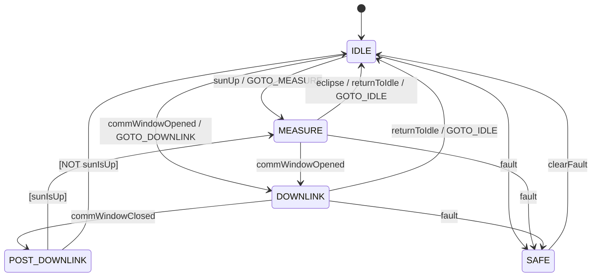

# Orion::EventAction Component

## 1. Introduction

The `Orion::EventAction` component is the centralized mission mode controller for the ORION satellite. It owns an FPP state machine (`MissionModeSm`) that governs the satellite's operational mode and broadcasts mode changes to all pipeline components. It evaluates transitions based on comm window state from [NavTelemetry](../nav-telemetry/), eclipse commands from ground, and fault signals.

EventAction also provides the `FLUSH_MEDIUM_STORAGE` command, which gates bulk file downlink behind comm window availability by forwarding requests to the F-Prime Svc::FileDownlink service.

## 2. Requirements

| Requirement  | Description                                                                                                                                     | Verification Method |
| ------------ | ----------------------------------------------------------------------------------------------------------------------------------------------- | ------------------- |
| ORION-EA-001 | EventAction shall manage a four-state mission mode state machine (IDLE, MEASURE, DOWNLINK, SAFE)                                                | Inspection          |
| ORION-EA-002 | EventAction shall broadcast mode changes to CameraManager, GroundCommsDriver, VlmInferenceEngine, and TriageRouter on every transition          | System test         |
| ORION-EA-003 | EventAction shall transition to DOWNLINK when NavTelemetry reports the satellite is within comm window range                                    | System test         |
| ORION-EA-004 | EventAction shall transition from DOWNLINK to MEASURE or IDLE based on the `sunIsUp` guard when the comm window closes                          | System test         |
| ORION-EA-005 | SAFE mode shall be reachable from any state and only exitable by ground command (`EXIT_SAFE_MODE`)                                              | System test         |
| ORION-EA-006 | On exiting SAFE mode, EventAction shall re-evaluate current conditions (comm window, eclipse) and auto-transition rather than remaining in IDLE | System test         |
| ORION-EA-007 | `FLUSH_MEDIUM_STORAGE` shall be rejected with `EXECUTION_ERROR` when the satellite is not in DOWNLINK mode                                      | System test         |
| ORION-EA-008 | `FLUSH_MEDIUM_STORAGE` shall validate that the storage path length does not exceed the FileDownlink 100-char limit before queuing files         | Inspection          |

## 3. Design

### 3.1 State Machine

The `MissionModeSm` is defined using FPP's built-in state machine syntax. It has four persistent states and one choice pseudo-state:

**Power doctrine:** The satellite measures during eclipse (on battery, can't charge anyway) and idles during sunlit passes (charge batteries for the next eclipse). This inverts the typical "measure in sunlight" approach, the rationale being solar charging is the priority when the sun is available.

**States:**

| State    | Purpose                                              | Entry Actions                                                     |
| -------- | ---------------------------------------------------- | ----------------------------------------------------------------- |
| IDLE     | Startup default, sunlit (charging), post-SAFE        | Broadcast IDLE to all components                                  |
| MEASURE  | Active imaging - captures, VLM triage, queue results | Broadcast MEASURE; components auto-load model and enable captures |
| DOWNLINK | Comm window open - flush queued HIGH frames          | Broadcast DOWNLINK; GroundCommsDriver flushes queue               |
| SAFE     | All operations suspended                             | Broadcast SAFE; all components halt                               |

**Signals:**

The state machine signal names are abstract internal identifiers. The physical mapping is inverted from the names, which means `sunUp` activates MEASURE but is triggered by eclipse entry, and `eclipse` deactivates to IDLE but is triggered by sun visibility.

| Signal             | Source                           | Physical trigger                        | State machine effect    |
| ------------------ | -------------------------------- | --------------------------------------- | ----------------------- |
| `sunUp`            | `SET_ECLIPSE true` command       | Satellite enters eclipse                | IDLE → MEASURE          |
| `eclipse`          | `SET_ECLIPSE false` command      | Sun visible (charging)                  | MEASURE → IDLE          |
| `commWindowOpened` | `schedIn_handler` edge detection | Within ground station range             | → DOWNLINK              |
| `commWindowClosed` | `schedIn_handler` edge detection | Left ground station range               | → POST_DOWNLINK         |
| `returnToIdle`     | `GOTO_IDLE` command              | Ground operator requests return to IDLE | MEASURE/DOWNLINK → IDLE |
| `fault`            | `ENTER_SAFE_MODE` command        | Ground operator initiates safe mode     | → SAFE                  |
| `clearFault`       | `EXIT_SAFE_MODE` command         | Ground operator clears safe mode        | SAFE → IDLE             |

**Guards:**

| Guard     | Implementation        | Used By                                                                          |
| --------- | --------------------- | -------------------------------------------------------------------------------- |
| `sunIsUp` | Returns `m_inEclipse` | POST_DOWNLINK choice: routes to MEASURE if in eclipse, IDLE if sunlit (charging) |

### 3.2 Implementation Notes

**Entry action timing:** F-Prime's autocoded state machine runs entry actions _before_ updating `m_state`. This means `missionMode_getState()` returns the _previous_ state during entry actions. The `signalToTargetMode()` helper derives the correct target mode from the signal instead.

**Init-time guard:** The state machine enters IDLE during `init()`, which fires the `broadcastMode` action before output ports are connected. The `m_portsConnected` flag suppresses this initial broadcast; the first `schedIn` tick broadcasts the initial IDLE mode after wiring is complete.

**SAFE mode re-sync:** When exiting SAFE via `EXIT_SAFE_MODE`, the handler re-evaluates current conditions (comm window and eclipse state) and sends the appropriate signal to auto-transition. This prevents missing a comm pass that opened while in SAFE.

### 3.3 Port Diagram

| Port               | Direction     | Type                  | Description                                                            |
| ------------------ | ------------- | --------------------- | ---------------------------------------------------------------------- |
| `schedIn`          | async input   | `Svc.Sched`           | 1 Hz rate group tick; polls NavTelemetry and detects comm window edges |
| `navStateIn`       | output (sync) | `NavStatePort`        | Queries NavTelemetry for lat/lon/alt and comm window flag              |
| `modeChangeOut[4]` | output        | `ModeChangePort`      | Broadcasts `MissionMode` enum to pipeline components                   |
| `sendFileOut`      | output (sync) | `Svc.SendFileRequest` | Queues files to F-Prime FileDownlink for MEDIUM bulk download          |

### 3.4 Commands

| Command                | Opcode | Arguments         | Behavior                                                                 |
| ---------------------- | ------ | ----------------- | ------------------------------------------------------------------------ |
| `SET_ECLIPSE`          | 0x00   | `inEclipse: bool` | Sets eclipse flag. `true` → MEASURE (eclipse). `false` → IDLE (charge).  |
| `ENTER_SAFE_MODE`      | 0x01   | none              | Sends `fault` signal. Rejected if already in SAFE.                       |
| `EXIT_SAFE_MODE`       | 0x02   | none              | Sends `clearFault` signal; re-syncs conditions. Rejected if not in SAFE. |
| `FLUSH_MEDIUM_STORAGE` | 0x03   | none              | Paced downlink of MEDIUM files (1/sec). Renamed to `.sent` after queue.  |
| `GOTO_IDLE`            | 0x10   | none              | Returns to IDLE. Only allowed from MEASURE or DOWNLINK.                  |
| `GOTO_MEASURE`         | 0x11   | none              | Transitions to MEASURE. Only allowed from IDLE.                          |
| `GOTO_DOWNLINK`        | 0x12   | none              | Transitions to DOWNLINK. Only allowed from IDLE.                         |

### 3.5 Events

| Event                  | Severity    | Description                                                  |
| ---------------------- | ----------- | ------------------------------------------------------------ |
| `ModeChanged`          | ACTIVITY_HI | Logged on every state transition with from/to mode names     |
| `SafeModeEntered`      | WARNING_HI  | Logged when entering SAFE mode                               |
| `SafeModeExited`       | ACTIVITY_HI | Logged when exiting SAFE mode                                |
| `CommWindowOpened`     | ACTIVITY_HI | Logged when comm window edge detected (rising)               |
| `CommWindowClosed`     | ACTIVITY_HI | Logged when comm window edge detected (falling)              |
| `MediumStorageFlushed` | ACTIVITY_HI | Logged with count of files queued for downlink               |
| `MediumFlushRejected`  | WARNING_LO  | Logged when FLUSH_MEDIUM_STORAGE called outside DOWNLINK     |
| `MediumPathTooLong`    | WARNING_HI  | Logged when storage path exceeds FileDownlink 100-char limit |
| `GotoRejected`         | WARNING_LO  | Logged when a GOTO/SAFE command is rejected (invalid state)  |

### 3.6 Telemetry

| Channel       | Type          | Description                                             |
| ------------- | ------------- | ------------------------------------------------------- |
| `CurrentMode` | `MissionMode` | Current state machine mode, updated on every transition |

### 3.7 Environment Variables

| Variable                   | Default              | Description                                                                                                         |
| -------------------------- | -------------------- | ------------------------------------------------------------------------------------------------------------------- |
| `ORION_MEDIUM_STORAGE_DIR` | `./media/sd/medium/` | Path to MEDIUM image storage. Must keep total path (dir + filename) under 100 chars for FileDownlink compatibility. |

## 4. Change Log

| Date       | Description                                                                   |
| ---------- | ----------------------------------------------------------------------------- |
| 2026-04-18 | Initial implementation: state machine, mode broadcasting, SAFE mode           |
| 2026-04-18 | Added CommWindow events, SAFE exit re-sync, FLUSH_MEDIUM_STORAGE              |
| 2026-04-20 | Inverted power doctrine: MEASURE during eclipse, IDLE during sunlit           |
| 2026-04-24 | Added GOTO commands and returnToIdle signal; guarded ENTER/EXIT_SAFE          |
| 2026-04-25 | Fixed MEDIUM flush: rename to `.sent` before queueing, rename back on failure |
| 2026-04-26 | Fixed MEDIUM storage default path to use relative `./media/sd/medium/`        |
| 2026-05-03 | Fixed SDD cross-reference links for mkdocs                                    |
