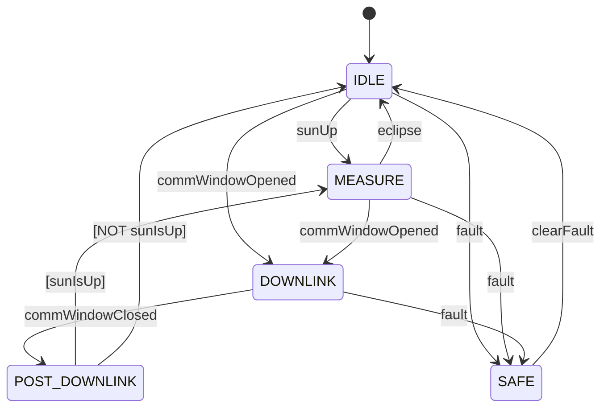

# Orion::EventAction Component

## 1. Introduction

The `Orion::EventAction` component is the centralized mission mode controller for the ORION satellite. It owns an FPP state machine (`MissionModeSm`) that governs the satellite's operational mode and broadcasts mode changes to all pipeline components. It evaluates transitions based on comm window state from [NavTelemetry](../../NavTelemetry/docs/sdd.md), eclipse commands from ground, and fault signals.

EventAction also provides the `FLUSH_MEDIUM_STORAGE` command, which gates bulk file downlink behind comm window availability by forwarding requests to the F-Prime [Svc::FileDownlink](../../../../../lib/fprime/Svc/FileDownlink/docs/sdd.md) service.

## 2. Requirements

| Requirement  | Description                                                                                                                                     | Verification Method |
| ------------ | ----------------------------------------------------------------------------------------------------------------------------------------------- | ------------------- |
| ORION-EA-001 | EventAction shall manage a four-state mission mode state machine (IDLE, MEASURE, DOWNLINK, SAFE)                                                | Inspection          |
| ORION-EA-002 | EventAction shall broadcast mode changes to CameraManager, GroundCommsDriver, VlmInferenceEngine, and TriageRouter on every transition          | System test         |
| ORION-EA-003 | EventAction shall transition to DOWNLINK when NavTelemetry reports the satellite is within comm window range                                    | System test         |
| ORION-EA-004 | EventAction shall transition from DOWNLINK to MEASURE or IDLE based on the `sunIsUp` guard when the comm window closes                          | System test         |
| ORION-EA-005 | SAFE mode shall be reachable from any state and only exitable by ground command (`EXIT_SAFE_MODE`)                                              | System test         |
| ORION-EA-006 | On exiting SAFE mode, EventAction shall re-evaluate current conditions (comm window, eclipse) and auto-transition rather than remaining in IDLE | System test         |
| ORION-EA-007 | `FLUSH_MEDIUM_STORAGE` shall be rejected with `EXECUTION_ERROR` when the satellite is not in DOWNLINK mode                                      | System test         |
| ORION-EA-008 | `FLUSH_MEDIUM_STORAGE` shall validate that the storage path length does not exceed the FileDownlink 100-char limit before queuing files         | Inspection          |

## 3. Design

### 3.1 State Machine

The `MissionModeSm` is defined using FPP's built-in state machine syntax. It has four persistent states and one choice pseudo-state:

**States:**

| State    | Purpose                                              | Entry Actions                                                     |
| -------- | ---------------------------------------------------- | ----------------------------------------------------------------- |
| IDLE     | Startup default, eclipse, post-SAFE                  | Broadcast IDLE to all components                                  |
| MEASURE  | Active imaging — captures, VLM triage, queue results | Broadcast MEASURE; components auto-load model and enable captures |
| DOWNLINK | Comm window open — flush queued HIGH frames          | Broadcast DOWNLINK; GroundCommsDriver flushes queue               |
| SAFE     | All operations suspended                             | Broadcast SAFE; all components halt                               |

**Signals:**

| Signal             | Source                           | Trigger                                                    |
| ------------------ | -------------------------------- | ---------------------------------------------------------- |
| `sunUp`            | `SET_ECLIPSE false` command      | Ground operator confirms sun visible                       |
| `eclipse`          | `SET_ECLIPSE true` command       | Ground operator signals eclipse                            |
| `commWindowOpened` | `schedIn_handler` edge detection | NavTelemetry reports satellite within ground station range |
| `commWindowClosed` | `schedIn_handler` edge detection | NavTelemetry reports satellite left ground station range   |
| `fault`            | `ENTER_SAFE_MODE` command        | Ground operator initiates safe mode                        |
| `clearFault`       | `EXIT_SAFE_MODE` command         | Ground operator clears safe mode                           |

**Guards:**

| Guard     | Implementation         | Used By                                                                  |
| --------- | ---------------------- | ------------------------------------------------------------------------ |
| `sunIsUp` | Returns `!m_inEclipse` | POST_DOWNLINK choice: routes to MEASURE if sun is up, IDLE if in eclipse |

### 3.2 Implementation Notes

**Entry action timing:** F-Prime's autocoded state machine runs entry actions _before_ updating `m_state`. This means `missionMode_getState()` returns the _previous_ state during entry actions. The `signalToTargetMode()` helper derives the correct target mode from the signal instead.

**Init-time guard:** The state machine enters IDLE during `init()`, which fires the `broadcastMode` action before output ports are connected. The `m_portsConnected` flag suppresses this initial broadcast; the first `schedIn` tick broadcasts the initial IDLE mode after wiring is complete.

**SAFE mode re-sync:** When exiting SAFE via `EXIT_SAFE_MODE`, the handler re-evaluates current conditions (comm window and eclipse state) and sends the appropriate signal to auto-transition. This prevents missing a comm pass that opened while in SAFE.

### 3.3 Port Diagram

| Port               | Direction     | Type                  | Description                                                            |
| ------------------ | ------------- | --------------------- | ---------------------------------------------------------------------- |
| `schedIn`          | async input   | `Svc.Sched`           | 1 Hz rate group tick; polls NavTelemetry and detects comm window edges |
| `navStateIn`       | output (sync) | `NavStatePort`        | Queries NavTelemetry for lat/lon/alt and comm window flag              |
| `modeChangeOut[4]` | output        | `ModeChangePort`      | Broadcasts `MissionMode` enum to pipeline components                   |
| `sendFileOut`      | output (sync) | `Svc.SendFileRequest` | Queues files to F-Prime FileDownlink for MEDIUM bulk download          |

### 3.4 Commands

| Command                | Opcode | Arguments         | Behavior                                                                                                                                                                                                                                                                                                                             |
| ---------------------- | ------ | ----------------- | ------------------------------------------------------------------------------------------------------------------------------------------------------------------------------------------------------------------------------------------------------------------------------------------------------------------------------------ |
| `SET_ECLIPSE`          | 0x00   | `inEclipse: bool` | Sets eclipse flag; sends `sunUp` or `eclipse` signal                                                                                                                                                                                                                                                                                 |
| `ENTER_SAFE_MODE`      | 0x01   | none              | Sends `fault` signal; reachable from any state                                                                                                                                                                                                                                                                                       |
| `EXIT_SAFE_MODE`       | 0x02   | none              | Sends `clearFault` signal; re-syncs conditions; only effective in SAFE                                                                                                                                                                                                                                                               |
| `FLUSH_MEDIUM_STORAGE` | 0x03   | none              | Starts paced downlink of all `orion_medium_*.raw` files from `ORION_MEDIUM_STORAGE_DIR`. Queues one file per `schedIn` tick (1 Hz) to avoid overwhelming FileDownlink's 10-entry queue. Each file is deleted from disk after successful queue. Flush auto-aborts if the satellite leaves DOWNLINK mode. Rejected if not in DOWNLINK. |

### 3.5 Events

| Event                  | Severity    | Description                                                    |
| ---------------------- | ----------- | -------------------------------------------------------------- |
| `ModeChanged`          | ACTIVITY_HI | Logged on every state transition with from/to mode names       |
| `SafeModeEntered`      | WARNING_HI  | Logged when entering SAFE mode                                 |
| `SafeModeExited`       | ACTIVITY_HI | Logged when exiting SAFE mode                                  |
| `CommWindowOpened`     | ACTIVITY_HI | Logged when comm window edge detected (rising)                 |
| `CommWindowClosed`     | ACTIVITY_HI | Logged when comm window edge detected (falling)                |
| `MediumStorageFlushed` | ACTIVITY_HI | Logged with count of files queued for downlink                 |
| `MediumFlushRejected`  | WARNING_LO  | Logged when FLUSH_MEDIUM_STORAGE called outside DOWNLINK       |
| `MediumPathTooLong`    | WARNING_HI  | Logged when storage path exceeds FileDownlink's 100-char limit |

### 3.6 Telemetry

| Channel       | Type          | Description                                             |
| ------------- | ------------- | ------------------------------------------------------- |
| `CurrentMode` | `MissionMode` | Current state machine mode, updated on every transition |

### 3.7 Environment Variables

| Variable                   | Default                   | Description                                                                                                         |
| -------------------------- | ------------------------- | ------------------------------------------------------------------------------------------------------------------- |
| `ORION_MEDIUM_STORAGE_DIR` | `/media/sd/orion/medium/` | Path to MEDIUM image storage. Must keep total path (dir + filename) under 100 chars for FileDownlink compatibility. |

## 4. Change Log

| Date       | Description                                                              |
| ---------- | ------------------------------------------------------------------------ |
| 2026-04-18 | Initial implementation: state machine, mode broadcasting, SAFE mode      |
| 2026-04-18 | Added CommWindow events, SAFE exit re-sync, FLUSH_MEDIUM_STORAGE command |
