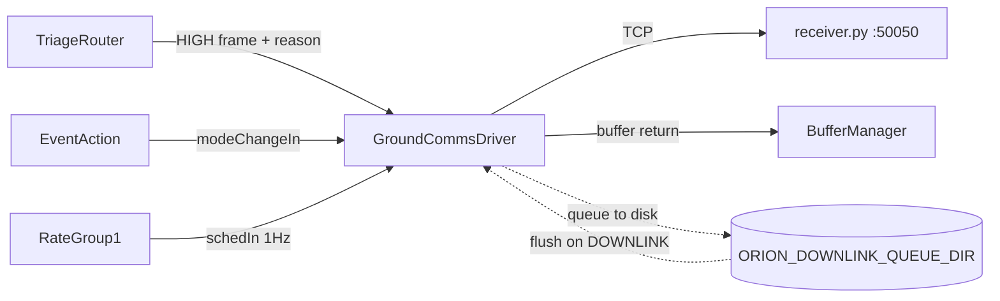

# Orion::GroundCommsDriver Component

## 1. Introduction

The `Orion::GroundCommsDriver` component manages the simulated X-band downlink from the satellite to the ground station. It receives HIGH-priority image frames from [TriageRouter](../triage-router/), transmits them over TCP to the ground receiver (`receiver.py`), and manages a disk-based queue for frames that arrive outside the comm window.

The component is mode-aware via [EventAction](../event-action/) broadcasts: it only transmits in DOWNLINK mode and queues frames to disk in all other modes.

## 2. Requirements

| Requirement   | Description                                                                                          | Verification Method |
| ------------- | ---------------------------------------------------------------------------------------------------- | ------------------- |
| ORION-GCD-001 | GroundCommsDriver shall transmit HIGH-priority frames immediately when in DOWNLINK mode              | System test         |
| ORION-GCD-002 | GroundCommsDriver shall queue HIGH-priority frames to disk when outside DOWNLINK mode                | System test         |
| ORION-GCD-003 | GroundCommsDriver shall flush all queued frames when entering DOWNLINK mode                          | System test         |
| ORION-GCD-004 | GroundCommsDriver shall periodically retry flushing queued frames during DOWNLINK mode at 1 Hz       | Inspection          |
| ORION-GCD-005 | GroundCommsDriver shall return all buffers to the BufferManager pool after processing                | Inspection          |
| ORION-GCD-006 | GroundCommsDriver shall delete queued files from disk only after successful transmission             | Inspection          |
| ORION-GCD-007 | GroundCommsDriver shall stop flushing the queue on the first transmit failure to avoid losing frames | Inspection          |

## 3. Design

### 3.1 Data Flow

### 3.2 Frame Protocol

Each frame transmitted over TCP has an 8-byte header followed by the raw pixel payload:

| Offset | Size    | Field          | Value                                       |
| ------ | ------- | -------------- | ------------------------------------------- |
| 0      | 4 bytes | Magic          | `0x4F52494F` ("ORIO") in network byte order |
| 4      | 4 bytes | Payload length | Raw image size in bytes, network byte order |
| 8      | N bytes | Payload        | Raw 512x512 RGB image data (786,432 bytes)  |

### 3.3 Operating Modes

**DOWNLINK mode:**

1. On mode entry (`modeChangeIn`): immediately flush all queued files from disk
2. On new HIGH frame arrival (`fileDownlinkIn`): flush queue first, then transmit the new frame
3. On 1 Hz tick (`schedIn`): flush queue (catches files queued in a race between mode change and arrival)

**All other modes (IDLE, MEASURE, SAFE):**

- New HIGH frames are written to disk via `saveToQueue`
- Buffer is returned to pool immediately
- No TCP connections are attempted

### 3.4 Queue Flush Behavior

`flushQueue()` scans `ORION_DOWNLINK_QUEUE_DIR` for files matching `orion_queued_*.raw`, reads each into a heap buffer, transmits via TCP, and deletes the file on success. On the first transmit failure, flushing stops, preventing losing frames when the receiver is down.

The 1 Hz `schedIn` tick retries the flush, so queued frames are not abandoned on a transient failure.

### 3.5 TCP Connection Model

Each `transmitRaw` call opens a new TCP connection, sends the header + payload, and closes the socket. This one-connection-per-frame model is simple but means:

- Connection setup overhead per frame (~1ms on LAN, more over WAN)
- Blocking `connect()` if the receiver is unreachable (OS-dependent timeout, typically 75s)
- During `flushQueue`, a down receiver blocks the GroundCommsDriver thread until timeout

### 3.6 Port Diagram

| Port              | Direction          | Type               | Description                                                        |
| ----------------- | ------------------ | ------------------ | ------------------------------------------------------------------ |
| `fileDownlinkIn`  | async input        | `FileDownlinkPort` | Receives HIGH-priority frames from TriageRouter with reason string |
| `schedIn`         | async input (drop) | `Svc.Sched`        | 1 Hz rate group tick for periodic queue flush during DOWNLINK      |
| `modeChangeIn`    | async input        | `ModeChangePort`   | Receives mode broadcasts from EventAction                          |
| `bufferReturnOut` | output             | `Fw.BufferSend`    | Returns image buffers to BufferManager pool                        |

### 3.7 Events

| Event              | Severity    | Description                                               |
| ------------------ | ----------- | --------------------------------------------------------- |
| `FrameDownlinked`  | ACTIVITY_HI | Logged per successful transmit with the VLM reason string |
| `TransmitFailed`   | WARNING_HI  | Logged when TCP connect or send fails                     |
| `FrameQueued`      | ACTIVITY_LO | Logged when a frame is saved to disk outside comm window  |
| `QueueFlushed`     | ACTIVITY_HI | Logged with count of frames flushed during comm window    |
| `QueueWriteFailed` | WARNING_HI  | Logged when writing a frame to the disk queue fails       |

### 3.8 Telemetry

| Channel            | Type | Description                                      |
| ------------------ | ---- | ------------------------------------------------ |
| `FramesDownlinked` | U32  | Running total of frames successfully transmitted |
| `BytesDownlinked`  | U32  | Running total of raw bytes transmitted           |
| `TransmitFailures` | U32  | Running total of failed transmit attempts        |
| `FramesQueued`     | U32  | Running total of frames queued to disk           |

### 3.9 Environment Variables

| Variable                   | Default                            | Description                      |
| -------------------------- | ---------------------------------- | -------------------------------- |
| `ORION_GDS_HOST`           | `127.0.0.1`                        | Ground receiver IP address       |
| `ORION_GDS_PORT`           | `50050`                            | Ground receiver TCP port         |
| `ORION_DOWNLINK_QUEUE_DIR` | `./media/sd/downlink_XBand_queue/` | Directory for disk-queued frames |

## 4. Known Issues

1. **Blocking TCP connect:** If the receiver is unreachable, `connect()` blocks for the OS default TCP timeout (typically 75s on Linux, 30s on macOS). During `flushQueue`, this blocks the GroundCommsDriver thread entirely, stalling all port handlers. The `schedIn` port uses `drop` policy so excess rate group ticks are silently discarded instead of asserting on queue overflow. Without `drop`, sustained blocking would fill the queue and trigger a fatal `FW_ASSERT` (observed in the 2026-05-05 run when CameraManager hit this first at ~56°S, crashing with `Os::Queue::Status::QUEUE_FULL`). A non-blocking connect with a short timeout would further prevent thread stalls.

2. **Heap allocation in flush loop:** `flushQueue` allocates a heap buffer per file (`new U8[fileSize]`). On the Pi's constrained memory, flushing many large files could fragment the heap. Using a fixed-size stack buffer (786KB matches the image size) would avoid this.

## 5. Change Log

| Date       | Description                                                                           |
| ---------- | ------------------------------------------------------------------------------------- |
| 2026-04-17 | Initial implementation: TCP transmit, disk queue, mode gating                         |
| 2026-04-18 | Fixed queue flush to preserve files on transmit failure; added QueueWriteFailed event |
| 2026-04-25 | Fixed default queue path to use relative `./media/sd/downlink_XBand_queue/`           |
| 2026-04-26 | Added recursive `ensureDirExists` for queue directory creation                        |
| 2026-05-03 | Fixed SDD cross-reference links for mkdocs                                            |
| 2026-05-03 | Renamed queue directory from `downlink_queue` to `downlink_XBand_queue`               |
| 2026-05-05 | Added `drop` policy to `schedIn` port to prevent fatal assert on queue overflow       |
