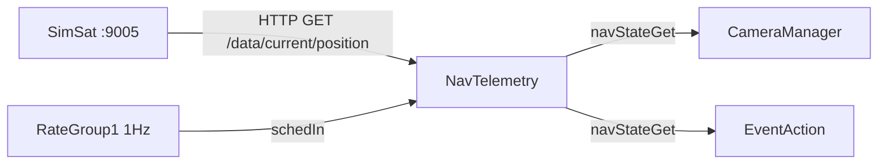

# Orion::NavTelemetry Component

## 1. Introduction

The `Orion::NavTelemetry` component manages the satellite's position state. It periodically polls the SimSat orbital propagator for GPS-like position updates (latitude, longitude, altitude) and computes whether the satellite is within the ground station's communication range.

NavTelemetry serves as the single source of truth for position data. Other components query it synchronously via the `navStateGet` guarded input port:

- [CameraManager](../../CameraManager/docs/sdd.md) reads position at capture time to fuse GPS coordinates with images
- [EventAction](../../EventAction/docs/sdd.md) reads position at 1 Hz to detect comm window edges and drive mode transitions

In a real mission, SimSat polling would be replaced by a hardware GNSS receiver driver.

## 2. Requirements

| Requirement  | Description                                                                                        | Verification Method |
| ------------ | -------------------------------------------------------------------------------------------------- | ------------------- |
| ORION-NT-001 | NavTelemetry shall poll SimSat for position at a configurable interval (default 5s)                | System test         |
| ORION-NT-002 | NavTelemetry shall compute ground station distance using the Haversine formula                     | Inspection          |
| ORION-NT-003 | NavTelemetry shall determine comm window state based on distance to ground station with hysteresis | System test         |
| ORION-NT-004 | NavTelemetry shall provide a thread-safe synchronous getter for NavState                           | Inspection          |
| ORION-NT-005 | NavTelemetry shall emit a warning event when SimSat is unreachable                                 | System test         |
| ORION-NT-006 | NavTelemetry shall retain the last known position when SimSat polling fails                        | Inspection          |

## 3. Design

### 3.1 Architecture

NavTelemetry is passive from the consumer's perspective: it never pushes data. Consumers call the `navStateGet` guarded port, which returns a `NavState` struct from cached state protected by the component mutex.

### 3.2 Polling

The `schedIn` handler fires at 1 Hz (from rate group 1). An internal counter (`m_schedCounter`) divides this down to poll SimSat every `POLL_INTERVAL_TICKS` = 5 ticks (i.e., every 5 seconds). On each poll:

1. `pollSimSat()` calls `SimSatClient::fetchPosition()` via HTTP GET to `ORION_SIMSAT_URL/data/current/position`
2. If successful, updates `m_lat`, `m_lon`, `m_alt` and emits `SimSatPositionUpdate`
3. If failed, emits `SimSatConnectionFailed` and retains last known position
4. `updateCommWindow()` computes Haversine distance to the ground station and updates `m_inCommWindow`
5. Telemetry channels are written

### 3.3 Comm Window Logic

The comm window is determined by great-circle (Haversine) distance between the satellite and the ground station:

- **Enter** comm window when `distance < gsRange` (default 2000 km)
- **Exit** comm window when `distance >= gsRange * 1.1` (2200 km)

The 10% hysteresis band prevents oscillation when the satellite is near the boundary. Without it, minor position jitter or polling timing could cause rapid MEASURE/DOWNLINK toggling.

### 3.4 NavState Struct

The `NavState` struct returned by `navStateGet` contains:

| Field          | Type | Description                                        |
| -------------- | ---- | -------------------------------------------------- |
| `lat`          | F64  | Latitude in degrees                                |
| `lon`          | F64  | Longitude in degrees                               |
| `alt`          | F64  | Altitude in km (from orbital propagator)           |
| `inCommWindow` | bool | True when satellite is within ground station range |
| `gsDistanceKm` | F64  | Great-circle distance to ground station in km      |

### 3.5 Port Diagram

| Port          | Direction     | Type           | Description                                                    |
| ------------- | ------------- | -------------- | -------------------------------------------------------------- |
| `navStateGet` | guarded input | `NavStatePort` | Synchronous getter returning cached NavState (mutex-protected) |
| `schedIn`     | async input   | `Svc.Sched`    | 1 Hz rate group tick; drives SimSat polling at 5s intervals    |

### 3.6 Events

| Event                    | Severity    | Description                                    |
| ------------------------ | ----------- | ---------------------------------------------- |
| `SimSatPositionUpdate`   | ACTIVITY_LO | Logged every 5s with lat, lon, alt from SimSat |
| `SimSatConnectionFailed` | WARNING_HI  | Logged when HTTP request to SimSat fails       |

### 3.7 Telemetry

| Channel        | Type | Description               |
| -------------- | ---- | ------------------------- |
| `CurrentLat`   | F64  | Last known latitude       |
| `CurrentLon`   | F64  | Last known longitude      |
| `CurrentAlt`   | F64  | Last known altitude in km |
| `InCommWindow` | bool | Current comm window state |

### 3.8 Environment Variables

| Variable            | Default                 | Description                                      |
| ------------------- | ----------------------- | ------------------------------------------------ |
| `ORION_SIMSAT_URL`  | `http://localhost:9005` | SimSat REST API base URL                         |
| `ORION_GS_LAT`      | `46.5191`               | Ground station latitude (default: EPFL Ecublens) |
| `ORION_GS_LON`      | `6.5668`                | Ground station longitude                         |
| `ORION_GS_RANGE_KM` | `2000.0`                | Comm window activation radius in km              |

## 4. Known Issues

1. **Comm window latency:** The comm window state only updates every 5 seconds (poll interval). EventAction checks at 1 Hz but sees stale data between polls. For LEO at ~7.5 km/s, this is a ~37 km position uncertainty, which is negligible relative to the 2000 km range.

2. **Blocking HTTP in rate group:** `SimSatClient::fetchPosition()` uses libcurl synchronously. If SimSat is slow or unreachable, this blocks the NavTelemetry thread. Since `schedIn` is async, the rate group isn't blocked, but subsequent NavTelemetry port calls queue up.

## 5. Change Log

| Date       | Description                                                                   |
| ---------- | ----------------------------------------------------------------------------- |
| 2026-04-17 | Initial implementation: SimSat polling, Haversine distance, comm window       |
| 2026-04-18 | Added gsDistanceKm to NavState, cached distance, added comm window hysteresis |
