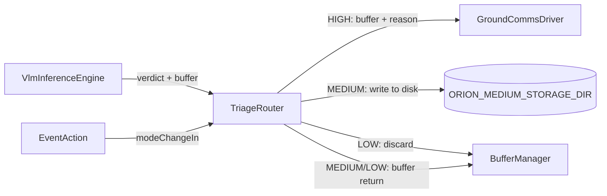
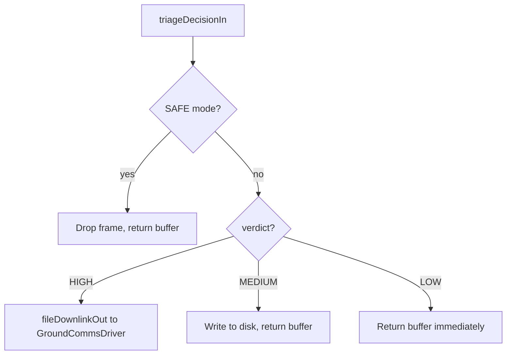

# Orion::TriageRouter Component

## 1. Introduction

The `Orion::TriageRouter` component executes the ORION triage doctrine. It receives classified image frames from [VlmInferenceEngine](../vlm-inference-engine/) and routes them based on the VLM's verdict:

- **HIGH**: forwarded to [GroundCommsDriver](../ground-comms-driver/) for immediate X-band downlink
- **MEDIUM**: written to bulk storage on the microSD card for later retrieval
- **LOW**: discarded, buffer returned to pool

TriageRouter decouples the VLM inference pipeline from the downlink and storage subsystems. The camera and VLM components have no knowledge of how results are routed.

## 2. Requirements

| Requirement  | Description                                                                       | Verification Method |
| ------------ | --------------------------------------------------------------------------------- | ------------------- |
| ORION-TR-001 | TriageRouter shall forward HIGH-priority frames to GroundCommsDriver for downlink | System test         |
| ORION-TR-002 | TriageRouter shall write MEDIUM-priority frames to disk storage                   | System test         |
| ORION-TR-003 | TriageRouter shall discard LOW-priority frames and return buffers to the pool     | System test         |
| ORION-TR-004 | TriageRouter shall drop all incoming frames in SAFE mode                          | System test         |
| ORION-TR-005 | TriageRouter shall return all buffers to the BufferManager pool after processing  | Inspection          |
| ORION-TR-006 | TriageRouter shall emit a warning event on storage write failure                  | System test         |

## 3. Design

### 3.1 Data Flow

### 3.2 Routing Logic

**HIGH route:** Buffer ownership transfers to GroundCommsDriver via `fileDownlinkOut`. GroundCommsDriver is responsible for returning the buffer to the pool after transmit. TriageRouter does not call `bufferReturnOut` for HIGH frames.

**MEDIUM route:** The raw image is written to `ORION_MEDIUM_STORAGE_DIR` as `orion_medium_XXXXX.raw` using a monotonic counter. The buffer is returned to the pool regardless of write success.

**LOW route:** Buffer is returned immediately. No data is retained.

**SAFE mode:** All frames are dropped and buffers returned. This prevents queuing work while the satellite is in a fault state.

### 3.3 Port Diagram

| Port               | Direction   | Type                 | Description                                                                  |
| ------------------ | ----------- | -------------------- | ---------------------------------------------------------------------------- |
| `triageDecisionIn` | async input | `TriageDecisionPort` | Receives verdict (HIGH/MEDIUM/LOW), reason string, and image buffer from VLM |
| `modeChangeIn`     | async input | `ModeChangePort`     | Receives mode broadcasts from EventAction                                    |
| `fileDownlinkOut`  | output      | `FileDownlinkPort`   | Forwards HIGH frames + reason to GroundCommsDriver                           |
| `bufferReturnOut`  | output      | `Fw.BufferSend`      | Returns image buffers to BufferManager pool                                  |

### 3.4 Events

| Event                | Severity    | Description                                                             |
| -------------------- | ----------- | ----------------------------------------------------------------------- |
| `HighTargetDetected` | ACTIVITY_HI | Logged for each HIGH verdict with the VLM reason string                 |
| `MediumTargetStored` | ACTIVITY_LO | Logged when a MEDIUM image is successfully written to disk              |
| `LowTargetDiscarded` | ACTIVITY_LO | Logged when a LOW frame is discarded (also used for SAFE mode drops)    |
| `StorageWriteFailed` | WARNING_HI  | Logged when the microSD write for a MEDIUM image fails or is incomplete |

### 3.5 Telemetry

| Channel               | Type | Description                                        |
| --------------------- | ---- | -------------------------------------------------- |
| `HighTargetsRouted`   | U32  | Running total of HIGH frames forwarded to downlink |
| `MediumTargetsSaved`  | U32  | Running total of MEDIUM frames written to disk     |
| `LowTargetsDiscarded` | U32  | Running total of LOW frames discarded              |

### 3.6 Environment Variables

| Variable                   | Default              | Description                             |
| -------------------------- | -------------------- | --------------------------------------- |
| `ORION_MEDIUM_STORAGE_DIR` | `./media/sd/medium/` | Directory for bulk MEDIUM image storage |

## 4. Change Log

| Date       | Description                                                                           |
| ---------- | ------------------------------------------------------------------------------------- |
| 2026-04-17 | Initial implementation: three-way routing, disk storage, SAFE mode gating             |
| 2026-04-18 | Added partial write detection in routeMedium; added logging for SAFE mode frame drops |
| 2026-04-25 | Fixed default MEDIUM storage path to use relative `./media/sd/medium/`                |
| 2026-05-03 | Fixed SDD cross-reference links for mkdocs                                            |
