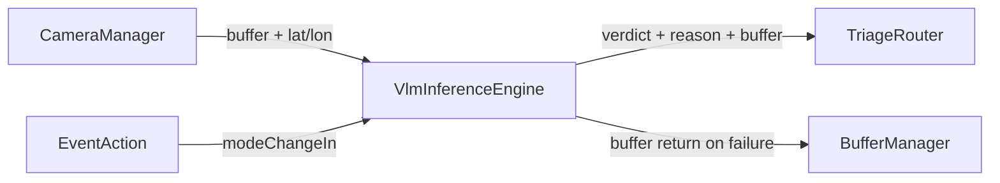
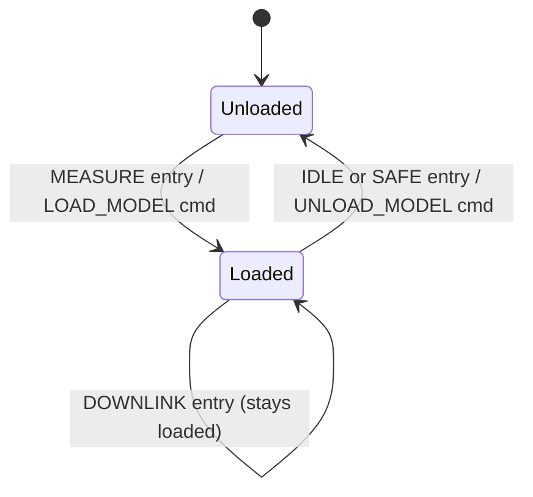

# Orion::VlmInferenceEngine Component

## 1. Introduction

The `Orion::VlmInferenceEngine` component runs the LFM2.5-VL-1.6B vision-language model on the satellite's CPU. It receives raw 512x512 RGB image frames from [CameraManager](../../CameraManager/docs/sdd.md), constructs a ChatML-formatted prompt with fused GPS coordinates, executes the llama.cpp forward pass, parses the JSON output into a triage verdict (HIGH/MEDIUM/LOW), and emits the result to [TriageRouter](../../TriageRouter/docs/sdd.md).

The model is a ~700 MB Q4_K_M GGUF file loaded into RAM on demand. Inference takes 50-60 seconds per frame on the Pi 5's Cortex-A76 cores (CPU-only, no GPU). The component runs on a dedicated low-priority thread to avoid blocking other flight software.

## 2. Requirements

| Requirement   | Description                                                                                              | Verification Method |
| ------------- | -------------------------------------------------------------------------------------------------------- | ------------------- |
| ORION-VLM-001 | VlmInferenceEngine shall load the GGUF model and mmproj vision encoder on MEASURE entry                  | System test         |
| ORION-VLM-002 | VlmInferenceEngine shall unload the model on transition to IDLE or SAFE                                  | System test         |
| ORION-VLM-003 | VlmInferenceEngine shall keep the model loaded during DOWNLINK (short pass, reload is expensive)         | Inspection          |
| ORION-VLM-004 | VlmInferenceEngine shall classify each frame as HIGH, MEDIUM, or LOW and emit the result to TriageRouter | System test         |
| ORION-VLM-005 | VlmInferenceEngine shall return buffers to the pool on inference failure                                 | Inspection          |
| ORION-VLM-006 | VlmInferenceEngine shall drop all frames in SAFE mode without inference                                  | System test         |
| ORION-VLM-007 | VlmInferenceEngine shall abort and recover from any inference exceeding `INFERENCE_TIMEOUT_S` (120 s)    | System test         |

## 3. Design

### 3.1 Data Flow



### 3.2 Inference Pipeline

For each frame, `runInference()` executes the following stages:

1. **Prompt construction** — ChatML format matching the fine-tuning template:

   ```
   <|im_start|>user
   <image>
   You are an autonomous orbital triage assistant...
   captured at Longitude: X, Latitude: Y.
   ...<|im_end|>
   <|im_start|>assistant
   ```

2. **Image encoding** — `mtmd_bitmap_init()` wraps the raw RGB buffer, `mtmd_tokenize()` replaces the image marker with vision encoder tokens

3. **KV cache evaluation** — `mtmd_helper_eval_chunks()` processes all prompt chunks (text + vision tokens) into the context. Timeout checked after eval.

4. **Autoregressive generation** — Greedy sampling up to `MAX_RESPONSE_TOKENS` (200 tokens), stopping on EOG token. Timeout checked per token.

5. **KV cache reset** — `llama_memory_clear()` and `llama_sampler_reset()` prepare for the next frame

6. **JSON parsing** — `parseVerdictJson()` extracts `"category"` and `"reason"` from the response

### 3.3 Inference Timeout

A self-watchdog checks elapsed time at two points during inference:

- **After prompt eval** — catches cases where vision encoding + context evaluation exceeds the limit
- **Per token in generation loop** — catches slow or stuck token generation

If elapsed time exceeds `INFERENCE_TIMEOUT_S` (120s), the inference is aborted: KV cache is cleared, sampler is reset, `InferenceTimeout` event is logged, and the frame is dropped. The model stays loaded and ready for the next frame — no restart required.

### 3.3 JSON Parser

The model is fine-tuned to output:

```json
{ "reason": "Dense geometric infrastructure...", "category": "HIGH" }
```

The parser:

- Searches the entire response for `"HIGH"`, `"MEDIUM"` (case-sensitive, quoted) to determine category. Defaults to LOW if neither found.
- Finds the `"reason"` key, extracts the string value while handling escaped quotes
- Falls back to the raw response as the reason if no `"reason"` key is found
- Falls back to `"Empty model response"` if the response is empty

### 3.4 Model Lifecycle



The model auto-loads on MEASURE entry and auto-unloads on IDLE or SAFE entry. During DOWNLINK, the model stays loaded to avoid the ~15s reload penalty on the Pi. Manual `LOAD_MODEL` and `UNLOAD_MODEL` commands are available for ground control.

### 3.5 Port Diagram

| Port                 | Direction   | Type                   | Description                                                    |
| -------------------- | ----------- | ---------------------- | -------------------------------------------------------------- |
| `inferenceRequestIn` | async input | `InferenceRequestPort` | Receives image buffer + GPS from CameraManager (queue depth 5) |
| `modeChangeIn`       | async input | `ModeChangePort`       | Receives mode broadcasts from EventAction                      |
| `triageDecisionOut`  | output      | `TriageDecisionPort`   | Emits verdict + reason + buffer to TriageRouter                |
| `bufferReturnOut`    | output      | `Fw.BufferSend`        | Returns buffer to pool on inference failure                    |

### 3.6 Commands

| Command        | Opcode | Behavior                                                                                           |
| -------------- | ------ | -------------------------------------------------------------------------------------------------- |
| `LOAD_MODEL`   | 0x00   | Loads GGUF text model + mmproj vision encoder. Idempotent. Rejected if not in MEASURE or DOWNLINK. |
| `UNLOAD_MODEL` | 0x01   | Frees all llama.cpp state from RAM.                                                                |

### 3.7 Events

| Event                        | Severity    | Description                                                     |
| ---------------------------- | ----------- | --------------------------------------------------------------- |
| `ModelLoaded`                | ACTIVITY_HI | Model and vision encoder loaded into RAM                        |
| `ModelUnloaded`              | ACTIVITY_HI | Model freed from RAM                                            |
| `ModelLoadFailed`            | WARNING_HI  | GGUF file or mmproj failed to load (with path)                  |
| `InferenceFailed`            | WARNING_HI  | Tokenization, eval, or generation failed for a frame            |
| `FrameDroppedModelNotLoaded` | WARNING_LO  | Frame arrived but model not loaded — buffer returned            |
| `LoadModelRejectedWrongMode` | WARNING_LO  | LOAD_MODEL rejected — not in MEASURE or DOWNLINK                |
| `InferenceComplete`          | ACTIVITY_HI | Successful classification with category, reason, and time in ms |

### 3.8 Telemetry

| Channel             | Type | Description                                       |
| ------------------- | ---- | ------------------------------------------------- |
| `InferenceTime_Ms`  | U32  | Wall-clock time of the most recent inference pass |
| `TotalInferences`   | U32  | Running total of successful classifications       |
| `InferenceFailures` | U32  | Running total of failed inference attempts        |

### 3.9 Configuration Constants

| Constant              | Value | Description                                |
| --------------------- | ----- | ------------------------------------------ |
| `IMAGE_W` / `IMAGE_H` | 512   | Expected input image dimensions            |
| `N_CTX`               | 4096  | KV cache context size in tokens            |
| `N_BATCH`             | 512   | Batch size for prompt evaluation           |
| `N_THREADS`           | 4     | CPU threads for inference (Pi 5 quad-core) |
| `MAX_RESPONSE_TOKENS` | 200   | Maximum tokens to generate per frame       |
| `IMAGE_MAX_TOKENS`    | 1024  | Cap on vision encoder output tokens        |
| `INFERENCE_TIMEOUT_S` | 120   | Abort inference after this many seconds    |

### 3.10 Environment Variables

| Variable            | Default                                 | Description                                |
| ------------------- | --------------------------------------- | ------------------------------------------ |
| `ORION_GGUF_PATH`   | `/home/saransh/ORION/orion-q4_k_m.gguf` | Path to the Q4_K_M quantized text model    |
| `ORION_MMPROJ_PATH` | `/home/saransh/orion-mmproj-f16.gguf`   | Path to the FP16 vision encoder projection |

## 4. Change Log

| Date       | Description                                                               |
| ---------- | ------------------------------------------------------------------------- |
| 2026-04-17 | Initial implementation: llama.cpp integration, ChatML prompt, JSON parser |
| 2026-04-18 | Fixed chat template (Phi-3 to ChatML), token limit, auto-lifecycle        |
| 2026-04-18 | Fixed model not unloading on DOWNLINK → SAFE transition                   |
| 2026-04-20 | Added mode gating, FrameDroppedModelNotLoaded, LoadModelRejectedWrongMode |
| 2026-04-24 | Removed health ping; added 120s self-watchdog with InferenceTimeout event |
